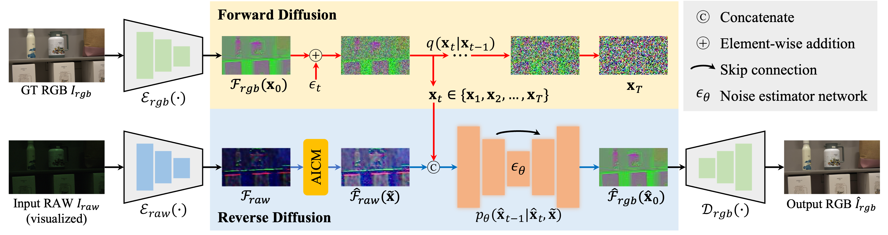

# [ICCV 2025] Learning to See in the Extremely Dark [[Paper]](https://arxiv.org/pdf/2506.21132)
<h4 align="center">Hai Jiang<sup>1</sup>, Binhao Guan<sup>2</sup>, Zhen Liu<sup>2</sup>, Xiaohong Liu<sup>3</sup>, Jian Yu<sup>4</sup>, Zheng Liu<sup>4</sup>, Songchen Han<sup>1</sup>, Shuaicheng Liu<sup>2</sup></center>
<h4 align="center">1.Sichuan University,</center></center>
<h4 align="center">2.University of Electronic Science and Technology of China,</center></center>
<h4 align="center">3.Shanghai Jiaotong University,</center></center>
<h4 align="center">4.National Innovation Center for UHD Video Technology</center></center>

## Dataset synthesis pipeline


## Framework pipeline


## Dependencies
```
pip install -r requirements.txt
````

## Download the raw training and evaluation datasets
### SIED dataset
Our SIED dataset is available at [[OneDrive]](https://1drv.ms/f/c/e379fe7c770e3033/Ejd2sO7WNMlGiAVSqFtu1KkBF8UL_RU9unCds1Mu8z8IPw?e=gyBKoy) and [[Baidu Yun (extracted code:4y4w)]](https://pan.baidu.com/s/13DpBAePEHpV0k4Mj96fgrw). Please see the txt files in ```data``` folder for the training set and evaluation set split. 

### SID dataset

## Pre-trained Models 
You can download our pre-trained model from [[OneDrive]](https://1drv.ms/f/c/e379fe7c770e3033/Ekg7dQ-J7PxCuJ3_-FQ_uNsB0ZWvwL2HUK3dSFcogki0jA?e=XWToVn) and [[Baidu Yun (extracted code:m9zp)]](https://pan.baidu.com/s/1m3pP50qopY8TRoGwt6wrjA)

## How to train?
You need to modify ```dataset/dataloader.py``` slightly for your environment, and then
```
accelerate launch train.py  
```

## How to test?
```
python inference.py
```

## Visual comparison


## Citation
If you use this code or ideas from the paper for your research, please cite our paper:
```
@inproceedings{sied,
    author    = {Jiang, Hai and Guan, Binhao and Liu, Zhen and Liu, Xiaohong and Yu, Jian and Liu, Zheng and Han, Songchen and Liu, Shuaicheng},
    title     = {Learning to See in the Extremely Dark},
    booktitle = {Proceedings of the IEEE/CVF International Conference on Computer Vision},
    month     = {October},
    year      = {2025},
    pages     = {7676-7685}
}
```

## Acknowledgement
Part of the code is adapted from the previous work: [denoising-diffusion-pytorch](https://github.com/lucidrains/denoising-diffusion-pytorch). We thank all the authors for their contributions.

